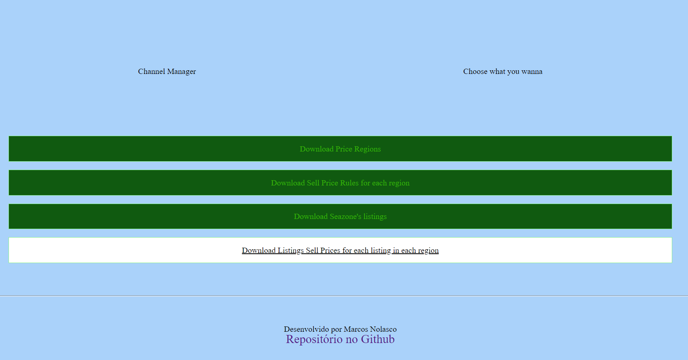

<h1 > Channel Manager </h1>
<h2 > WebServer que gera e baixa arquivos CSV por meio de uma WebPage. </h2>

## Construída com Django, como parte do processo seletivo da Seazone.

<h4> 
	 🚀 Desenvolvimento finalizado...  🚧
</h4>

<h1 align="center">
  
</h1>

## Para reproduzir este projeto, é necessário ter Python e Pip atualizados.

### Clone este repositório

```
git clone <https://github.com/caro-marks/channel-manager>
```

### Acesse a pasta do projeto no terminal/cmd

```
cd channel-manager
```

### Crie um ambiente virtual e ative-o

```
py -m venv venv
./venv/Scripts/activate
```

### Instale as dependências

```
py -m pip install -r requirements.txt
```

### Execute a aplicação em modo de desenvolvimento

```
py manage.py runserver
```

#### O servidor inciará na porta:8000 - acesse <http://127.0.0.1:8000/>

### 🛠 Tecnologias

A ferramenta usada na construção do projeto foi:

- [Django](https://www.djangoproject.com/)

Os arquivos CSV gerados foram criados utilizando os dados da API da Stays

- [Stays-API](https://stays.net/external-api/#introduction)

### <a>🚀Feito por</a>

<a href="https://www.linkedin.com/in/caro-marks">
   <b>Marcos Nolasco</b> 👋🏽
</a>

---
